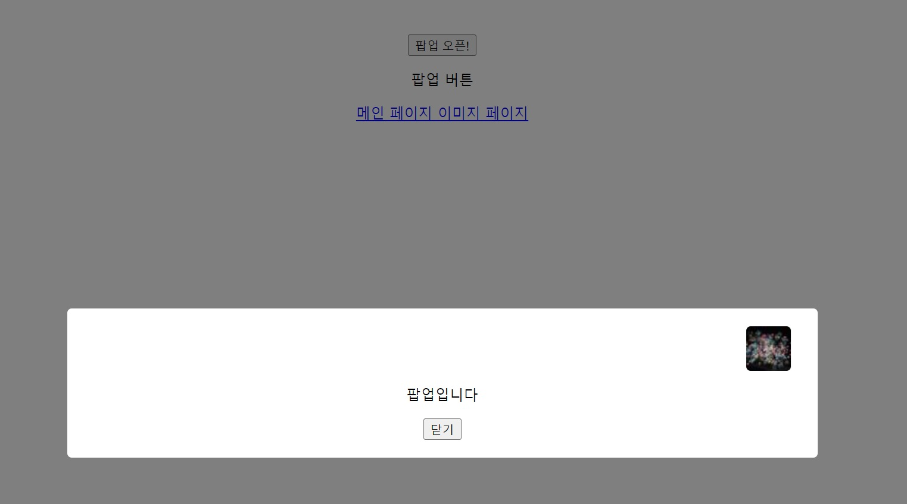

# Vue 팝업 컴포넌트

Vue.js를 사용하여 만든 간단한 팝업 컴포넌트 예제

## 기능

- 메인 페이지에 팝업 열기 버튼 표시
- 버튼 클릭 시 팝업 창 열기
- 팝업 창에 랜덤 이미지 표시
- 팝업 창 닫기 기능

## 스크린샷

## 사용 방법

1. 프로젝트를 클론
3. 개발 서버를 실행 `npm run dev`
4. 브라우저에서 `http://localhost:5173/`으로 접속
4. "팝업 오픈!" 버튼을 클릭하여 팝업을 열기
5. 팝업 내의 "닫기" 버튼을 클릭하여 팝업을 닫기

## 참조

- 랜덤 이미지는 [Picsum](https://picsum.photos/)에서 제공